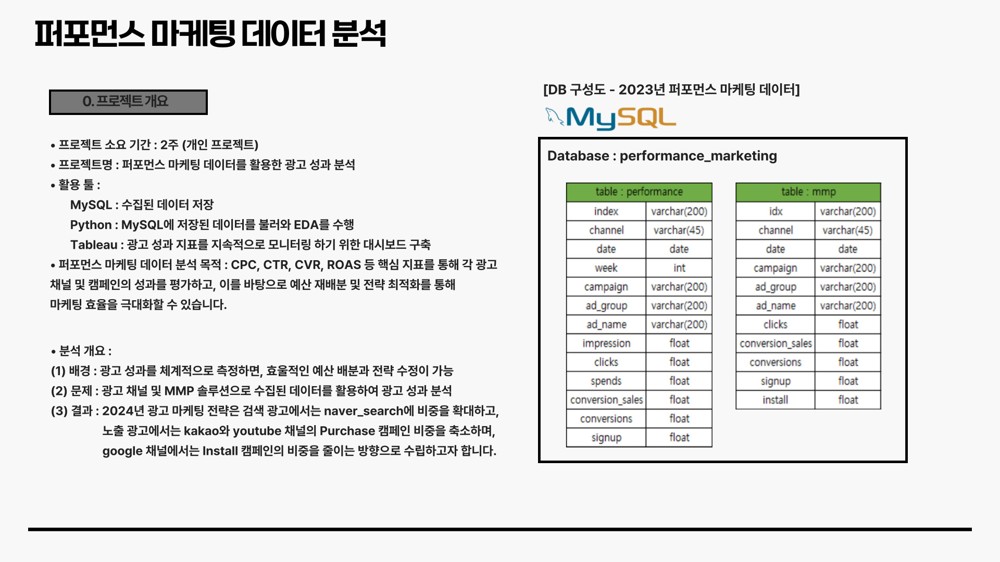
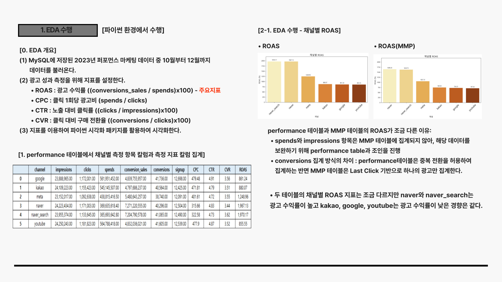
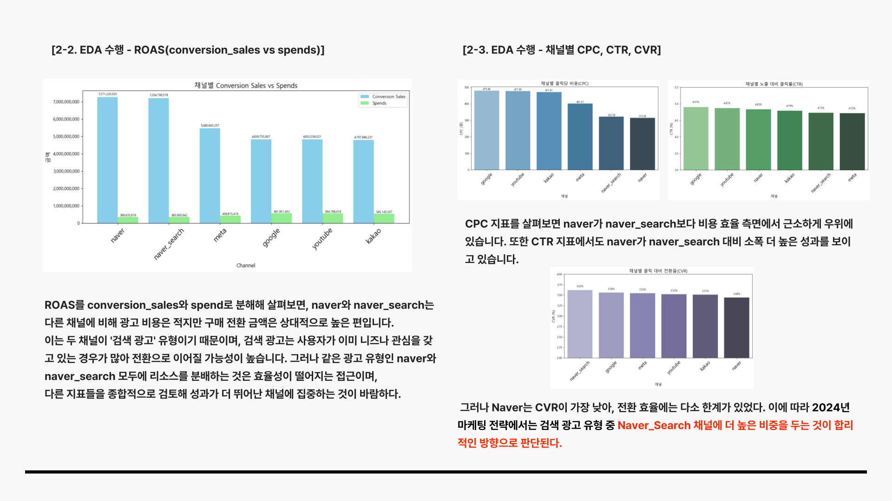
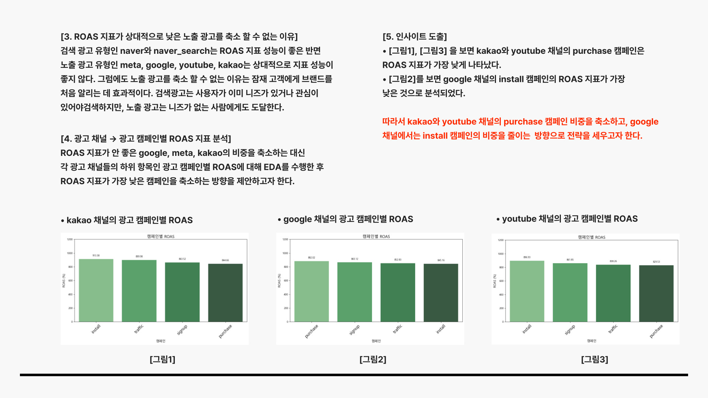
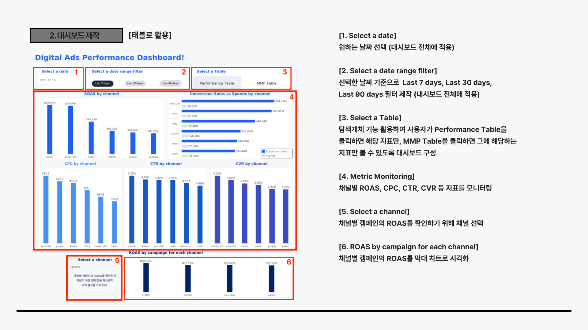

# 1. 퍼포먼스 데이터 분석
### 📁 Repository Structure
```bash
├─ 📂 Data/                     # 원본 및 정제 데이터 (업로드 제외)
├─ 📂 Img/                      # README 이미지
├─ ⚙️ .gitignore                   # Git 추적 제외 설정
├─ 📓 excel_to_csv_1.ipynb      # Excel → MySQL 업로드
├─ 📓 pm_EDA_2.ipynb            # 퍼포먼스 마케팅 데이터 EDA
├─ 📓 mmp_EDA_3.ipynb           # MMP 데이터 EDA
├─ 📓 Mysql_Tableau연동.txt       # MySQL-Tableau 연동 방법.txt
├─ 📓 퍼포먼스마케팅_대시보드(mysql연동).twbx   # Tableau 대시보드 파일
└─ 📘 README.md                 # 프로젝트 설명 파일
```

# 2. 퍼포먼스 데이터 분석 개요



# 3. EDA 수행 in Python







# 4. 태블로 대시보드 제작
- 이후 발생하는 데이터에 대해 주요 지표를 실시간 또는 정기적으로 모니터링할 필요가 있다. 
- 이를 위해 Tableau(태블로) 를 활용하여, 핵심 지표를 한눈에 파악할 수 있는 대시보드를 구축했다.
### Tableau Public 링크 : [퍼포먼스 마케팅 대시보드 바로가기](https://public.tableau.com/app/profile/kyun8996/viz/__prj/performance)


